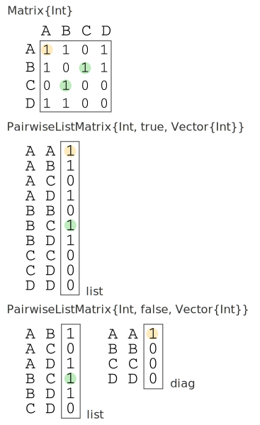

```@meta
CurrentModule = PairwiseListMatrices
```

# PairwiseListMatrices

## Introduction  

**PairwiseListMatrices** allows you to represent a (squared) **symmetric
matrix** as a list of the values in the upper or lower triangular part of the
matrix. Those matrices are common for representing **pairwise
measures/comparisons** between the elements of one group when the used
metric/distance satisfies the symmetry condition. Also the **adjacency matrices
of undirected graphs** can be represented with this kind of list/matrices.  

## Installation  

This package is registered on Julia's METADATA.jl and it can be installed
through the Julia's REPL:  

```julia
Pkg.add("PairwiseListMatrices")
```  

If the package is installed on your system, you can load it with:  

```julia
using PairwiseListMatrices
```  

## Simple example  

The following symmetric matrix has 9 values. Their values could be thought as
pairwise measures between 3 elements:  

```@repl
matrix = [  0 10 20
           10  0 30
           20 30  0 ]
```  

Since all the diagonal members are zeros, this matrix could be represented as a
vector/list of the 3 values on the triangular part:  

```@repl list
list = [10, 20, 30]
```  

The type `PairwiseListMatrix`, defined in this module, can be used for working
with the list as a full symmetric matrix.  

```@repl list
using PairwiseListMatrices
plm = PairwiseListMatrix(list)
```

## Implementation  

If you are performing pairwise measures over `N` elements, storing all the `N*N`
values of a `Matrix{T}` represents `sizeof(T)*(N*N)` bytes of memory. However,
the lower and upper triangular parts of the matrix are identical and could be
stored in a single list. In this way, you are storing the green value only once:  



The diagonal values should be stored, since they could change at any time
(i.e. yellow value). So you need `sizeof(T)*(N)` bytes for storing the diagonal
values on a vector and `sizeof(T)*(N*(N-1))/2` bytes for storing the lower or
upper triangular part of the matrix.
The type `PairwiseListMatrix{T, diagonal, VT}` represents the symmetric matrix
using only `sizeof(T)*(N*(N+1))/2` bytes instead of `sizeof(T)*(N*N)` bytes,
saving almost 50% of the memory (the percent depends on `N`):  

```@example
using Plots
gr()
plot(      2:550,
           N -> 100.0 - ( 100.0 * div(N*(N+1), 2) / (N*N) ),
           xlab = "N",
           ylab = "% of saved memory",
           legend = nothing        )
png("curve.png") # hide
nothing # hide
```  


As you can see in the schematic diagram, the difference between
`PairwiseListMatrix{T, true, VT}` and `PairwiseListMatrix{T, false, VT}` is
where the diagonal values are stored. All `PairwiseListMatrix{T, diagonal, VT}`
have a `list` field for storing the values. If `diagonal` is true, the diagonal
values are included in the `list` (i.e. yellow value) and the `diag` vector is
empty. But if the `diagonal` value is `false` the diagonal values are stored in
the `diag` vector.  

```julia
mutable struct PairwiseListMatrix{T,diagonal,VT} <: AbstractArray{T, 2}
    list::VT
    diag::VT
    nelements::Int
    ...
end
```  

The number of elements in the pairwise measure/comparisons or the number of
nodes in the undirected graph is stored in `nelements` and used in indexing
operations. This allows you to index the object like any other matrix.  

The `PairwiseListMatrix` can be wrapped in a `NamedArray` (from the package
`NamedArrays`) to allow the access of elements using labels. The function
`setlabel` can be used to create this object easily. For example, using the
matrix of the figure and storing the diagonal values in the list:

```@repl
using PairwiseListMatrices
plm = PairwiseListMatrix([1,1,0,1,0,1,1,0,0,0], true)
nplm = setlabels(plm, ["A","B","C","D"])
nplm["B","C"]
```  

You can also create the matrix with the list without the diagonal values and
fill the diagonal values after that:  

```@repl
using PairwiseListMatrices
plm = PairwiseListMatrix([1,0,1,1,1,0], false)
nplm = setlabels(plm, ["A","B","C","D"])
nplm["A","A"] = 1
nplm
```  

## Ploting

You can use the [Plots](https://juliaplots.github.io/) package to visualize
this matrices quickly as heat maps. If you are looking for more complex
visualization, you can use the
[PlotRecipes](https://github.com/JuliaPlots/PlotRecipes.jl) package. This last
package provides **arc diagram**, **chord diagram/circos** and other
`graphplot`s (since those matrices could be a representation for an
**adjacency matrix/list** of an undirected graph).  

```@example
using PairwiseListMatrices
plm = PairwiseListMatrix([1,1,0,1,0,1,1,0,0,0], true)
nplm = setlabels(plm, ["A","B","C","D"])

using Plots
gr()
plot(nplm)
png("heatmap.png") # hide
nothing # hide
```  

  

## Benchmark

`PairwiseListMatrix` is faster than a full matrix to make operation like `sum`
and `mean` in the whole matrix, since it is cache efficient. However it is
slower than a full matrix for reducing along dimensions.

 - [Creation benchmark](http://nbviewer.ipython.org/github/diegozea/PairwiseListMatrices.jl/blob/master/test/creation_bech.ipynb)
 - [Statistics benchmark](http://nbviewer.ipython.org/github/diegozea/PairwiseListMatrices.jl/blob/master/test/stats_bench.ipynb)
